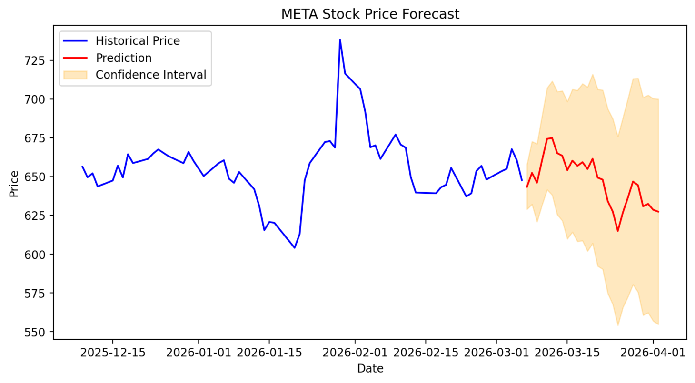

# StockForecastingAI
Real-time stock forecasting using FastAPI, Streamlit and ML

An end-to-end machine learning system that predicts future stock prices using historical market data.

This project uses real-time stock data, a prediction API, and an interactive dashboard to visualize historical trends and future forecasts with confidence intervals.

Its features include:
1) Real-time stock data using Yahoo Finance
2) Stock price forecasting using statistical modeling
3) Confidence interval visualization for predictions
4) FastAPI backend serving prediction API
5) Interactive Streamlit dashboard
6) Historical + predicted price visualization

Tech used: Python, FastAPI, Streamlit, NumPy, Pandas, Matplotlib, yfinance  

Working: 
1) Historical stock data is downloaded using **yfinance**.
2) Returns and volatility are calculated from historical prices.
3) A forecasting model predicts future prices using stochastic returns.
4) Confidence intervals are generated to show prediction uncertainty.
5) Predictions are served through a **FastAPI** backend.
6) A **Streamlit dashboard** visualizes historical prices and predicted future values.

To start the FastAPI backend:
uvicorn app.main:app –reload

To run the Streamlit dashboard:
streamlit run dashboard.py

The dashboard show (based on the stock selected):
1) Historical stock price trend
2) Predicted future price
3) Confidence interval band around predictions

## Dashboard Preview

